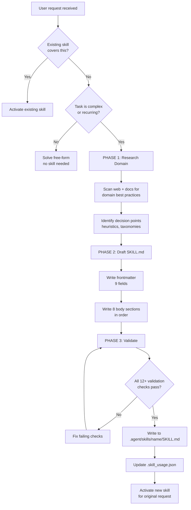

# Mission

Create production-grade SKILL.md capability modules from scratch when no existing skill
covers the user's task. Each forged skill must encode **real domain knowledge** — not
generic instructions — and be immediately activatable by any agent in the system.

Skill-forge is the **meta-skill**: the skill that creates other skills. It enforces a
strict quality standard so every generated skill is indistinguishable from a hand-crafted
expert module.

---

# When To Activate

Activate skill-forge when ALL of the following are true:

1. **No existing skill matches** — you scanned `.agent/skills/` and found no semantic match
2. **The task is complex or recurring** — one-off questions don't need a skill
3. **Domain knowledge is encodable** — the task has learnable patterns, heuristics, or decision trees
4. **The user explicitly requests** — phrases like "create a skill", "forge a skill", "we need a skill for X"

Do NOT activate when:
- An existing skill already covers the domain (even partially — extend it instead)
- The task is a one-time question answerable without structured reasoning
- The domain is too narrow for reuse (e.g., "fix this specific CSS bug")

---

# Core Concepts

## 1. SKILL.md Format Specification

Every SKILL.md follows a strict two-part structure:

### Part A — YAML Frontmatter (9 required fields)

| Field | Type | Constraint | Purpose |
|-------|------|------------|---------|
| `name` | string | kebab-case, 2-4 words | Unique identifier used in `@skill-name` activation |
| `description` | string | ≤ 200 chars, starts with "Use this skill when" | First-pass routing — must contain trigger phrases |
| `version` | semver | `major.minor.patch` | Track breaking changes to reasoning graphs |
| `triggers` | list | 5-8 natural language phrases | Semantic routing matches — use real user language |
| `token_budget` | integer | 2000-8000 | Max tokens the skill should consume per activation |
| `tools_required` | list | Tool names from IDE | Declare dependencies for capability checking |
| `output_contract` | object | `format` + `includes` list | What the user receives — testable deliverables |
| `works_with` | list | Skill names | Declares composability for multi-skill workflows |
| `risk` | enum | low / medium / high | Governs review requirements before execution |

### Part B — Body Sections (8 required, in order)

1. **Mission** — One paragraph. WHY this skill exists. What gap it fills.
2. **When To Activate** — Activation conditions (DO activate) + exclusions (do NOT activate).
3. **Core Concepts** — The domain knowledge. Decision tables, heuristics, taxonomies. This is the BRAIN.
4. **Reasoning Graph** — Mermaid flowchart showing the decision/execution flow.
5. **Execution Steps** — Numbered steps with imperative verbs. Each step = one tool call or decision.
6. **Failure Modes** — Table: Symptom → Root Cause → Recovery Action. Min 3 rows.
7. **Validation Gate** — Checkbox list (≥ 12 items) that MUST all pass before declaring done.
8. **Output Contract** — What gets delivered: file paths, formats, quality criteria.

## 2. Quality Rubric

Every forged skill is evaluated on a 1-10 scale across 5 dimensions:

| Dimension | Score 1-3 (Reject) | Score 4-6 (Revise) | Score 7-10 (Accept) |
|-----------|--------------------|--------------------|---------------------|
| **Specificity** | Generic advice anyone could write | Some domain terms but vague | Concrete heuristics, thresholds, decision tables |
| **Actionability** | "Consider doing X" | Steps exist but ambiguous | Every step = one tool call with exact parameters |
| **Completeness** | Missing sections | All sections but some thin | All 8 sections substantial, no placeholders |
| **Composability** | Standalone only | References other skills | `works_with` populated, context handoff defined |
| **Testability** | "It should work" | Some checks mentioned | ≥ 12 validation checkboxes, all verifiable |

**Minimum passing score: 7 average across all dimensions.**

## 3. Token Budget Guidelines

| Skill Complexity | Recommended Budget | Example |
|------------------|--------------------|---------|
| Narrow tool wrapper | 2000-3000 | git-commit-linter |
| Domain specialist | 3000-5000 | sql-query-optimizer |
| Multi-phase workflow | 5000-8000 | full-stack-scaffolder |

## 4. Description Writing Rules

The `description` field is the most critical routing signal. Rules:

1. **Start with** "Use this skill when" — always
2. **Include 2+ concrete trigger scenarios** from real user language
3. **Stay under 200 characters** — routing scans are fast
4. **Avoid jargon** unless the jargon IS the trigger (e.g., "OWASP", "TDD")
5. **Never use** "helps with", "assists in", "provides support for" — these are weak signals

### Examples

- ✅ `Use this skill when optimizing SQL queries for performance. Triggers on slow query analysis, missing index detection, and execution plan review.`
- ❌ `This skill helps with database stuff and provides assistance for query optimization.`

## 5. Trigger Phrase Design

Triggers power semantic routing. Design rules:

1. Use **natural user language**, not technical jargon
2. Include **both explicit requests** ("create a migration") and **implicit signals** ("the database is slow")
3. Cover **5-8 phrases** — too few = missed activations, too many = false positives
4. Test each trigger: "Would a user actually say this?" If no, remove it

---

# Reasoning Graph



---

# Execution Steps

## Phase 1 — Research the Domain (before writing anything)

1. **Scan installed skills** — run `ls .agent/skills/` and check if any existing skill partially covers the domain. If yes, consider extending it instead of forging new.
2. **Identify the domain** — name the knowledge area in 2-4 words (this becomes the skill name in kebab-case).
3. **Research best practices** — use `web_search` to find authoritative sources: official docs, style guides, RFCs, established taxonomies (e.g., OWASP for security, Fowler for refactoring).
4. **Extract decision points** — list 5-10 concrete decisions a practitioner makes in this domain (these become the Core Concepts).
5. **Map the workflow** — sketch the step-by-step process an expert follows (this becomes the Reasoning Graph + Execution Steps).
6. **Catalog failure modes** — identify 3+ common mistakes and their fixes (this becomes the Failure Modes table).

## Phase 2 — Write the SKILL.md

7. **Create the directory** — `mkdir -p .agent/skills/<name>/`
8. **Write YAML frontmatter** — populate all 9 fields per the format specification. Pay special attention to `description` (≤ 200 chars, starts with "Use this skill when") and `triggers` (5-8 natural language phrases).
9. **Write Mission** — one paragraph explaining WHY this skill exists and what gap it fills. Be specific about what was missing before.
10. **Write When To Activate** — list activation conditions AND exclusions. The exclusions prevent false activations.
11. **Write Core Concepts** — this is the BRAIN of the skill. Encode real domain knowledge: decision tables, threshold values, classification taxonomies, evaluation rubrics. No generic advice.
12. **Write Reasoning Graph** — create a Mermaid flowchart showing the decision flow. Every branch must have a clear condition.
13. **Write Execution Steps** — numbered list with imperative verbs. Each step should map to exactly one tool call or decision. Include expected outputs.
14. **Write Failure Modes** — table with ≥ 3 rows: Symptom | Root Cause | Recovery Action. Use real error messages where possible.
15. **Write Validation Gate** — ≥ 12 checkboxes. Every box must be independently verifiable. Include both structural checks (frontmatter complete) and quality checks (Core Concepts encode real knowledge).
16. **Write Output Contract** — list exact deliverables: file paths, formats, quality criteria.

## Phase 3 — Validate and Register

17. **Run Validation Gate** — go through every checkbox. Fix any failures before proceeding.
18. **Check line count** — body sections must be under 500 lines. Trim if over.
19. **Check description length** — must be ≤ 200 characters. Tighten if over.
20. **Score against Quality Rubric** — rate 1-10 on all 5 dimensions. If any dimension scores below 7, revise.
21. **Write the file** — save to `.agent/skills/<name>/SKILL.md`
22. **Update usage tracking** — write activation timestamp to `.agent/skills/.skill_usage.json`:
    ```json
    { "<skill-name>": "2026-03-15T10:30:00Z" }
    ```
23. **Read the reference example** — if quality is uncertain, read `.agent/skills/skill-forge/references/annotated-example.md` for a gold-standard comparison.
24. **Activate the new skill** — immediately use the newly forged skill to complete the user's original request.

---

# Failure Modes

| Symptom | Root Cause | Recovery Action |
|---------|-----------|-----------------|
| Skill activates for unrelated requests (false positive) | Triggers too broad or description too generic | Narrow triggers to domain-specific phrases; add "Do NOT activate when" exclusions |
| Core Concepts section reads like a blog post | Research phase skipped; no real domain knowledge extracted | Go back to Phase 1, step 3. Use `web_search` to find authoritative sources. Extract concrete heuristics, thresholds, and decision tables |
| Validation Gate has only 5-6 checkboxes | Skill is under-specified; not enough quality criteria | Add checks for: frontmatter completeness, trigger quality, Core Concepts depth, Reasoning Graph coverage, Execution Steps actionability, Output Contract specificity |
| `description` exceeds 200 characters | Trying to explain everything in one field | Rewrite to pattern: "Use this skill when [condition]. Triggers on [2-3 key scenarios]." |
| New skill duplicates an existing skill | Installed skills not scanned before forging | Always run `ls .agent/skills/` in Phase 1, step 1. Check for semantic overlap, not just name match |
| Execution Steps are vague ("analyze the code") | Steps don't map to tool calls | Rewrite each step as: [Imperative verb] + [specific object] + [expected output]. E.g., "Run `grep -r 'TODO' src/` and list files with unresolved items" |
| Token budget exceeded during activation | Budget set too low for skill complexity | Review Token Budget Guidelines table. Multi-phase workflows need 5000-8000 tokens |

---

# Validation Gate

Before declaring a forged skill complete, ALL of the following must be true:

## Structural Checks
- [ ] SKILL.md file exists at `.agent/skills/<name>/SKILL.md`
- [ ] YAML frontmatter is valid and parseable
- [ ] All 9 frontmatter fields are populated (no empty values)
- [ ] `name` field is kebab-case, 2-4 words
- [ ] `description` is ≤ 200 characters and starts with "Use this skill when"
- [ ] `triggers` list has 5-8 entries
- [ ] `token_budget` is between 2000-8000
- [ ] All 8 body sections are present in correct order

## Quality Checks
- [ ] Core Concepts contains at least one decision table, taxonomy, or heuristic with concrete values
- [ ] Reasoning Graph is a valid Mermaid flowchart with ≥ 4 decision nodes
- [ ] Execution Steps use imperative verbs and map to specific tool calls
- [ ] Failure Modes table has ≥ 3 rows with real error messages or symptoms
- [ ] No placeholder content exists (no "TODO", "...", "Add content here", "TBD")
- [ ] Quality Rubric score ≥ 7 average across all 5 dimensions

## Registration Checks
- [ ] `.skill_usage.json` updated with activation timestamp
- [ ] Skill directory contains only SKILL.md (no extraneous files unless scripts are needed)

---

# Output Contract

When skill-forge completes, the user receives:

1. **Primary deliverable**: `.agent/skills/<name>/SKILL.md` — a complete, validated skill file
2. **Usage tracking entry**: `.agent/skills/.skill_usage.json` updated with `{ "<name>": "<ISO-8601>" }`
3. **Activation confirmation**: The new skill is immediately activated to handle the original request
4. **Quality report**: The 5-dimension quality scores (Specificity, Actionability, Completeness, Composability, Testability)

### File Format

```
.agent/skills/<name>/
├── SKILL.md          # The skill definition (required)
├── scripts/          # Helper scripts (optional, if skill needs automation)
└── references/       # Reference material (optional, for complex domains)
```

### Quality Criteria

- Body sections total under 500 lines
- Description under 200 characters
- All validation gate checkboxes pass
- Quality rubric average ≥ 7/10
- No placeholder or stub content anywhere

---

## TTL Watcher (Skill Auto-Expiry)

Custom skills created by skill-forge are tracked in:
  `.agent/skills/.skill_usage.json`

Format: `{ "<skill-name>": "<ISO-8601-timestamp-of-last-use>" }`

The model MUST write to this file every time it activates a custom skill:
```json
{
  "<skill-name>": "2026-03-15T10:30:00Z"
}
```

To delete skills unused for 30+ days, run:
```bash
python .agent/skills/skill-forge/scripts/ttl_watcher.py
```

Protected skills (never deleted):
  task-planner, debugging-master, code-synthesizer, architecture-analyst,
  system-auditor, test-generator, security-auditor, performance-optimizer,
  refactoring-specialist, research-engine, dependency-analyzer,
  documentation-writer, frontend-design, skill-forge

Set up automatic monthly cleanup with cron:
```bash
0 9 1 * * cd /path/to/project && python .agent/skills/skill-forge/scripts/ttl_watcher.py >> .agent/skills/.ttl_log.txt 2>&1
```
